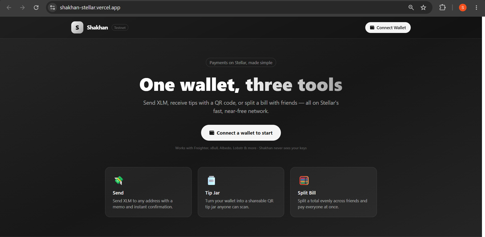
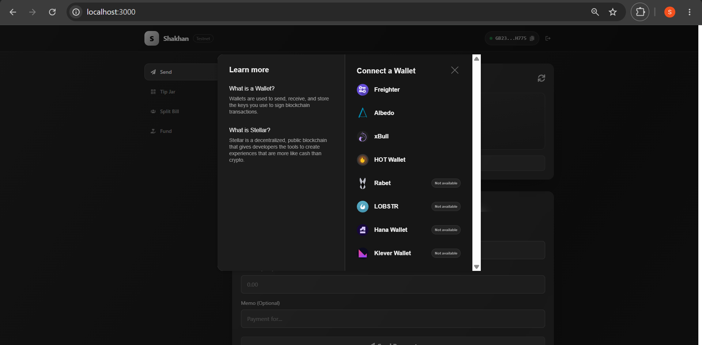
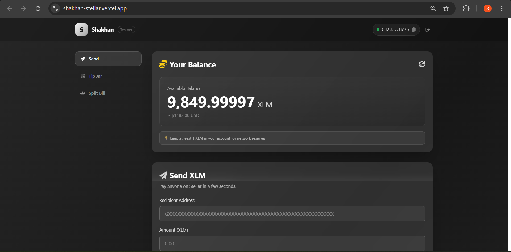
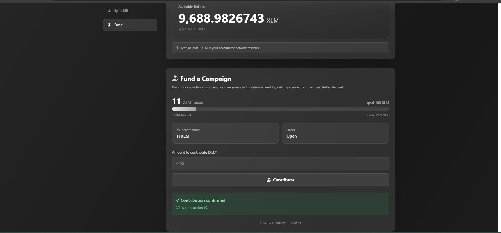
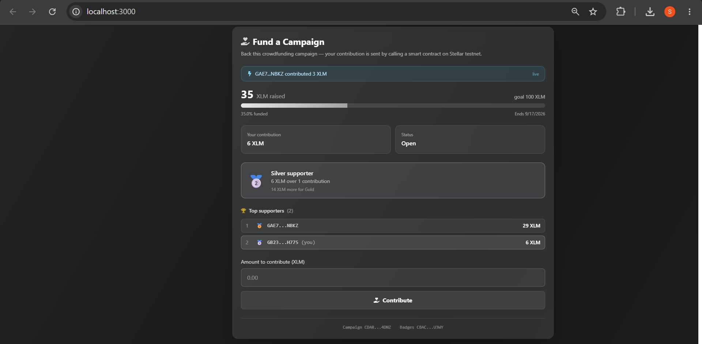
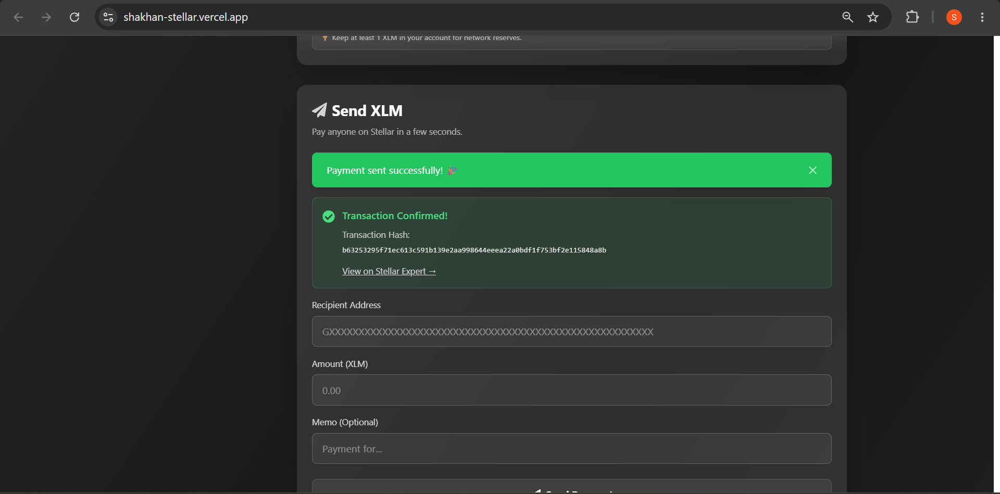
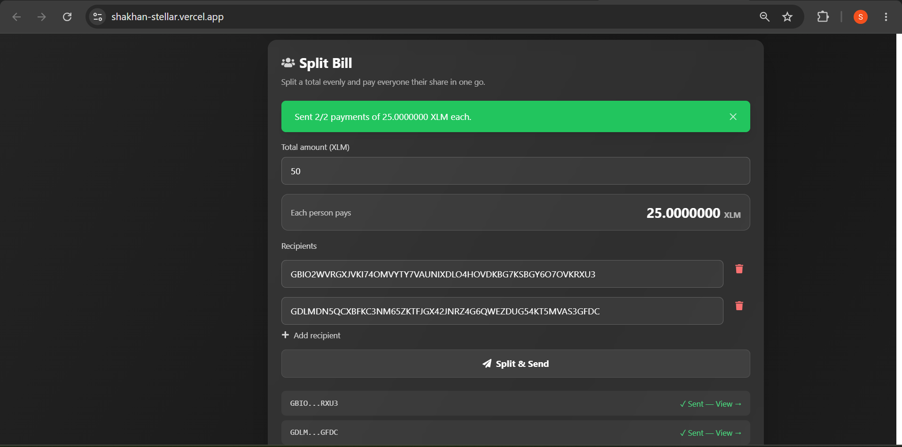
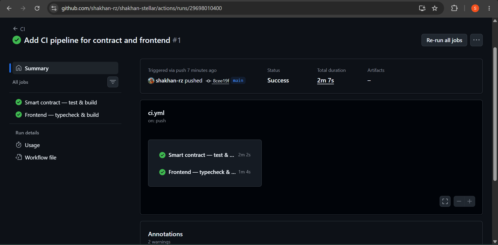
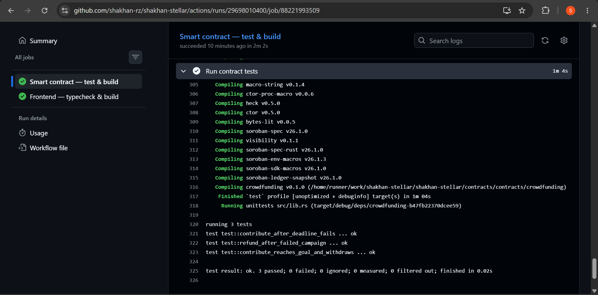

# Shakhan — Stellar Money Toolkit

A small, focused payments toolkit built on the **Stellar** blockchain (testnet). Instead of one generic "dashboard", Shakhan bundles four everyday money tools behind a single wallet connection:

- **💸 Send** — send XLM to any Stellar address with an optional memo and instant confirmation.
- **🫙 Tip Jar** — turn your wallet into a shareable QR page so anyone can scan and send you a tip.
- **🧮 Split Bill** — enter a total, add a few friends, and pay everyone their even share in one flow.
- **🫱 Fund** — back a crowdfunding campaign by calling a **Soroban smart contract** on testnet.

Built for the **Stellar Journey to Mastery** challenge — White Belt (Level 1) and **Yellow Belt (Level 2)**.

**🌐 Live demo:** https://shakhan-stellar.vercel.app

> ⚠️ Runs on **Stellar Testnet** only. No real funds are ever used.

---

## 🟡 Yellow Belt — Smart Contract

The **Fund** tab is backed by a crowdfunding contract written in Rust with the Soroban SDK, deployed on Stellar testnet and invoked directly from the browser.

### Deployment

| | |
|---|---|
| **Contract address** | [`CDIM27Z5AFBAP2OV6BI236K32DBXYAGZAIIICPRPRJM4QJV5FFKAGZ4R`](https://stellar.expert/explorer/testnet/contract/CDIM27Z5AFBAP2OV6BI236K32DBXYAGZAIIICPRPRJM4QJV5FFKAGZ4R) |
| **Network** | Testnet (`Test SDF Network ; September 2015`) |
| **WASM hash** | `f2f3e40d65dec23a628c73023a179b8b660d72ff44aceaab626c62c7922cd4bc` |
| **Deploy transaction** | [`355171439b0c…`](https://stellar.expert/explorer/testnet/tx/355171439b0c4f8a8eaf0441826b3b4b26197b1570a1acdf0fa2fda36d0d7054) |
| **Token** | Native XLM via the Stellar Asset Contract `CDLZFC3SYJYDZT7K67VZ75HPJVIEUVNIXF47ZG2FB2RMQQVU2HHGCYSC` |

### Verifiable contract call

A `contribute` call made from the app's **Fund** tab, signed by a browser wallet:

**🔗 [`e122a2c9760c2594244d230cad8ad095f3bda5899aa7a633d9ac622106433ad6`](https://stellar.expert/explorer/testnet/tx/e122a2c9760c2594244d230cad8ad095f3bda5899aa7a633d9ac622106433ad6)**

> Status `SUCCESS` · ledger 3679653 · confirmed 2026-07-18

The campaign's `initialize` call is also on-chain: [`57a9b61ff083…`](https://stellar.expert/explorer/testnet/tx/57a9b61ff0839733f844b570715f5a8e4f062424462a6dc1ae2496527bd85311)

### Contract interface

| Function | What it does |
|---|---|
| `initialize(recipient, token, goal, deadline)` | Set up the campaign. Can only run once. |
| `contribute(donor, amount)` | Pull tokens from the donor into the contract. Requires the donor's auth. |
| `withdraw()` | Recipient claims the funds — only once the goal is reached. |
| `refund(donor)` | Donor reclaims their money — only if the deadline passed without reaching the goal. |
| `goal()` `total_raised()` `deadline()` `recipient()` `contribution(donor)` | Read-only getters the frontend uses to render campaign state. |

### Error handling

The contract returns **seven typed errors** through `#[contracterror]` instead of panicking, so the frontend can tell the user exactly what went wrong:

| Error | Raised when |
|---|---|
| `AlreadyInitialized` | `initialize` is called on a campaign that already exists |
| `NotInitialized` | any action is attempted before `initialize` |
| `InvalidAmount` | a goal or contribution is zero or negative |
| `DeadlinePassed` | someone contributes after the campaign closed |
| `GoalNotReached` | the recipient tries to withdraw early |
| `DeadlineNotReached` | a donor asks for a refund while the campaign is still open |
| `NothingToRefund` | a refund is requested by someone who never contributed |

### How the frontend calls it

`lib/crowdfunding.ts` is the contract client:

- **Reads** (`goal`, `total_raised`, `deadline`, `contribution`) go through RPC **simulation** — no signature, no fee, no transaction.
- **Writing** (`contribute`) builds an invoke transaction, runs `prepareTransaction` to attach the Soroban footprint, auth entries and resource fees, hands it to the wallet for signing, submits it, then **polls the ledger until it confirms**.

Transaction status is surfaced in the UI at every stage — *sending → confirmed (with an explorer link) → failed (with the reason)*.

---

## ✨ Features

| Requirement | Where it lives |
|---|---|
| Connect / disconnect a wallet | Header wallet button → `app/page.tsx` |
| Fetch & display XLM balance | `components/BalanceDisplay.tsx` |
| Send an XLM transaction on testnet | `components/PaymentForm.tsx` |
| Transaction feedback (success/fail + hash) | `components/PaymentForm.tsx`, `components/SplitBill.tsx` |
| Activity / transaction history | `components/TransactionHistory.tsx` |
| **Yellow Belt:** smart contract | `contracts/contracts/crowdfunding/src/lib.rs` |
| **Yellow Belt:** contract called from frontend | `lib/crowdfunding.ts`, `components/FundCampaign.tsx` |
| **Bonus:** QR tip jar | `components/TipJar.tsx` |
| **Bonus:** multi-recipient split payments | `components/SplitBill.tsx` |

The app connects through **Stellar Wallets Kit**, so it works with Freighter, xBull, Albedo, Rabet, Lobstr, Hana, WalletConnect and more. Signing always happens **inside the user's wallet** — Shakhan never sees a private key.

---

## 🛠️ Tech Stack

- **Next.js 14** (App Router) + **React 18**
- **TypeScript**
- **Tailwind CSS**
- **Rust + Soroban SDK 26** — the crowdfunding smart contract
- **@stellar/stellar-sdk 16** — Horizon + Soroban RPC calls
- **@creit.tech/stellar-wallets-kit** — multi-wallet connection & signing
- **qrcode.react** — Tip Jar QR codes

> The SDK is pinned to **v16** because Stellar's protocol 23 introduced `TransactionMetaV4`. Older SDKs (≤ v13) only understand meta V0–V3 and fail with `Bad union switch: 4` when reading a contract call's receipt.

---

## 🚀 Run it locally

**Prerequisites:** Node.js 18+ and a Stellar wallet extension (e.g. [Freighter](https://www.freighter.app/)) set to **Test Net**.

```bash
# 1. install dependencies
npm install

# 2. start the dev server
npm run dev

# 3. open the app
#    http://localhost:3000
```

Then:

1. Click **Connect Wallet** (top-right) and approve in your wallet.
2. Fund your testnet account with free XLM via [Friendbot](https://friendbot.stellar.org/) if the balance is 0.
3. Use the **Send / Tip Jar / Split Bill / Fund** tabs.

### Building the contract

```bash
cd contracts
rustup target add wasm32v1-none
stellar contract build
```

### Running the tests

```bash
cd contracts
cargo test
```

---

## 🔄 CI

[](https://github.com/shakhan-rz/shakhan-stellar/actions/workflows/ci.yml)

[`.github/workflows/ci.yml`](.github/workflows/ci.yml) runs on every push and pull request to `main`, as two parallel jobs:

| Job | Steps |
|---|---|
| **Smart contract** | `cargo fmt --check` → `cargo test` (3 tests) → `cargo build --target wasm32v1-none --release` |
| **Frontend** | `npm ci` → `tsc --noEmit` → `next build` |

Both jobs install from the lockfile (`--locked`, `npm ci`) rather than re-resolving dependencies. That is deliberate: `soroban-env-host` declares `ed25519-dalek ">=2.0.0"`, so a plain build silently picked up the 3.0.0 release and broke `cargo test` on a transitive trait change. Installing from the lockfile turns that class of drift into a loud failure instead of a mystery.

The cargo registry and `target/` are cached against `Cargo.lock`, so runs after the first skip rebuilding the soroban-sdk tree.

---

## 📸 Screenshots

**Landing**


**Wallet options** — Stellar Wallets Kit offers Freighter, xBull, Albedo, Lobstr and more


**Wallet connected + balance**


**Fund — contributing through the smart contract**


**Live update** — a contribution made from the CLI, in another process
entirely, arriving in the browser through the contract's `Contributed` event.
The badge and leaderboard below it are read from a second contract.


**Successful testnet Send (with transaction hash)**


**Split Bill — paid everyone at once**


**CI pipeline — both jobs green on every push**


**Contract test output — 3 passing tests**


---

## 📂 Project structure

```
app/
  layout.tsx           # metadata + root layout
  page.tsx             # header wallet connect + app shell (sidebar/tabs)
  globals.css
components/
  BalanceDisplay.tsx
  PaymentForm.tsx      # Send
  TipJar.tsx           # Tip Jar (QR)         <- custom
  SplitBill.tsx        # Split Bill           <- custom
  FundCampaign.tsx     # Fund (contract UI)   <- Yellow Belt
  TransactionHistory.tsx
  example-components.tsx
lib/
  stellar-helper.ts    # payment logic (Stellar Wallets Kit + Horizon)
  crowdfunding.ts      # Soroban contract client   <- Yellow Belt
contracts/
  contracts/crowdfunding/
    src/lib.rs         # the smart contract
    src/test.rs        # contract tests
```

---

## 🔒 A note on safety

- Testnet only — the network passphrase is `Test SDF Network ; September 2015`.
- Private keys never touch the app; every transaction is signed by the connected wallet.
- Always double-check a recipient address — blockchain payments can't be undone.
