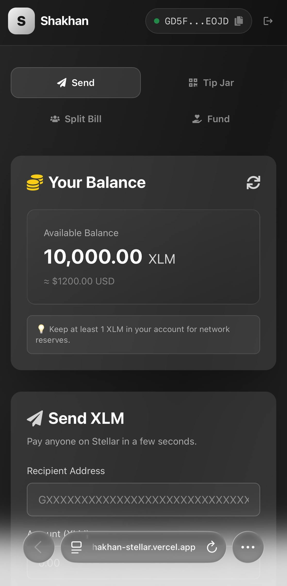

# Shakhan — Stellar Money Toolkit

A small, focused payments toolkit built on the **Stellar** blockchain (testnet). Instead of one generic "dashboard", Shakhan bundles four everyday money tools behind a single wallet connection:

- **💸 Send** — send XLM to any Stellar address with an optional memo and instant confirmation.
- **🫙 Tip Jar** — turn your wallet into a shareable QR page so anyone can scan and send you a tip.
- **🧮 Split Bill** — enter a total, add a few friends, and pay everyone their even share in one flow.
- **🫱 Fund** — back a crowdfunding campaign by calling a **Soroban smart contract** on testnet.

Built for the **Stellar Journey to Mastery** challenge — White Belt (Level 1), Yellow Belt (Level 2) and **Orange Belt (Level 3)**.

Orange Belt adds a **second smart contract** (a supporter badge registry) that the campaign calls **contract-to-contract** on every contribution, streams contract **events** into the UI in real time, and ships a **CI/CD pipeline**, a **mobile-responsive** frontend, and tests on both the contracts and the frontend.

**🌐 Live demo:** https://shakhan-stellar.vercel.app

> ⚠️ Runs on **Stellar Testnet** only. No real funds are ever used.

---

## 🟡 Yellow Belt — Smart Contract

The **Fund** tab is backed by a crowdfunding contract written in Rust with the Soroban SDK, deployed on Stellar testnet and invoked directly from the browser.

### Deployment

| | |
|---|---|
| **Contract address** | [`CDIM27Z5AFBAP2OV6BI236K32DBXYAGZAIIICPRPRJM4QJV5FFKAGZ4R`](https://stellar.expert/explorer/testnet/contract/CDIM27Z5AFBAP2OV6BI236K32DBXYAGZAIIICPRPRJM4QJV5FFKAGZ4R) |
| **Network** | Testnet (`Test SDF Network ; September 2015`) |
| **WASM hash** | `f2f3e40d65dec23a628c73023a179b8b660d72ff44aceaab626c62c7922cd4bc` |
| **Deploy transaction** | [`355171439b0c…`](https://stellar.expert/explorer/testnet/tx/355171439b0c4f8a8eaf0441826b3b4b26197b1570a1acdf0fa2fda36d0d7054) |
| **Token** | Native XLM via the Stellar Asset Contract `CDLZFC3SYJYDZT7K67VZ75HPJVIEUVNIXF47ZG2FB2RMQQVU2HHGCYSC` |

### Verifiable contract call

A `contribute` call made from the app's **Fund** tab, signed by a browser wallet:

**🔗 [`e122a2c9760c2594244d230cad8ad095f3bda5899aa7a633d9ac622106433ad6`](https://stellar.expert/explorer/testnet/tx/e122a2c9760c2594244d230cad8ad095f3bda5899aa7a633d9ac622106433ad6)**

> Status `SUCCESS` · ledger 3679653 · confirmed 2026-07-18

The campaign's `initialize` call is also on-chain: [`57a9b61ff083…`](https://stellar.expert/explorer/testnet/tx/57a9b61ff0839733f844b570715f5a8e4f062424462a6dc1ae2496527bd85311)

### Contract interface

| Function | What it does |
|---|---|
| `initialize(recipient, token, goal, deadline)` | Set up the campaign. Can only run once. |
| `contribute(donor, amount)` | Pull tokens from the donor into the contract. Requires the donor's auth. |
| `withdraw()` | Recipient claims the funds — only once the goal is reached. |
| `refund(donor)` | Donor reclaims their money — only if the deadline passed without reaching the goal. |
| `goal()` `total_raised()` `deadline()` `recipient()` `contribution(donor)` | Read-only getters the frontend uses to render campaign state. |

### Error handling

The contract returns **seven typed errors** through `#[contracterror]` instead of panicking, so the frontend can tell the user exactly what went wrong:

| Error | Raised when |
|---|---|
| `AlreadyInitialized` | `initialize` is called on a campaign that already exists |
| `NotInitialized` | any action is attempted before `initialize` |
| `InvalidAmount` | a goal or contribution is zero or negative |
| `DeadlinePassed` | someone contributes after the campaign closed |
| `GoalNotReached` | the recipient tries to withdraw early |
| `DeadlineNotReached` | a donor asks for a refund while the campaign is still open |
| `NothingToRefund` | a refund is requested by someone who never contributed |

### How the frontend calls it

`lib/crowdfunding.ts` is the contract client:

- **Reads** (`goal`, `total_raised`, `deadline`, `contribution`) go through RPC **simulation** — no signature, no fee, no transaction.
- **Writing** (`contribute`) builds an invoke transaction, runs `prepareTransaction` to attach the Soroban footprint, auth entries and resource fees, hands it to the wallet for signing, submits it, then **polls the ledger until it confirms**.

Transaction status is surfaced in the UI at every stage — *sending → confirmed (with an explorer link) → failed (with the reason)*.

---

## 🟠 Orange Belt — Two contracts, events & a pipeline

Orange Belt is about production-grade smart-contract work. The Fund tab is now backed by **two** Soroban contracts that talk to each other on-chain, and the frontend listens to their **events** instead of just re-reading numbers.

### Architecture

```
 Browser (Fund tab)
      │  contribute(donor, amount)
      ▼
┌──────────────────────┐   award(campaign, supporter, amount)   ┌────────────────────┐
│  Crowdfunding         │ ─────────────────────────────────────▶ │  Badge registry     │
│  contract             │        (contract-to-contract call)      │  contract           │
│  CDARMHEB…4DNZ        │ ◀───────────────────────────────────── │  CBACUDL2…U3WY      │
└──────────────────────┘             Badge (tier, total)         └────────────────────┘
      │                                                                    │
      │  emits Contributed / BadgeAwardFailed                              │ emits BadgeAwarded
      ▼                                                                    ▼
              getEvents() polling  ──▶  live balance, badge & leaderboard in the UI
```

### Deployed contracts

| | Crowdfunding | Badge registry |
|---|---|---|
| **Address** | [`CDARMHEBXGGGVQ53GASWRQHWDCVVB7O6SXZLZY47PTPINF6DDZWW4DNZ`](https://stellar.expert/explorer/testnet/contract/CDARMHEBXGGGVQ53GASWRQHWDCVVB7O6SXZLZY47PTPINF6DDZWW4DNZ) | [`CBACUDL2SDBNBPDBDBFND6LQYZW25LKNFWWXZSWI277TA5WHXYFFU3WY`](https://stellar.expert/explorer/testnet/contract/CBACUDL2SDBNBPDBDBFND6LQYZW25LKNFWWXZSWI277TA5WHXYFFU3WY) |
| **WASM hash** | `0ded1560f80e4087ca634bf992fa370d42c0c8deaf3758abcad28ab8fe29eaa4` | `c7945fc91cb1024bbb9ec9853f4ec2dd1f152084cdcbe15598c82246c57c3298` |
| **Network** | Testnet (`Test SDF Network ; September 2015`) | same |
| **Deploy tx** | [`e2f7be1ede7c…`](https://stellar.expert/explorer/testnet/tx/e2f7be1ede7c0d0cb4addb9c7c072469200b4365c335c66dd62893d70e7f8337) | [`1ae424906e1a…`](https://stellar.expert/explorer/testnet/tx/1ae424906e1a2685cd6b6815db13f88dfb44b4827cf32cb027b6813a40584dd2) |
| **Source** | `contracts/contracts/crowdfunding/src/lib.rs` | `contracts/contracts/badge/src/lib.rs` |

> ✅ Both contracts are live and wired: at the time of writing the campaign has raised **168 XLM** toward its 100 XLM goal, and the badge registry reports its Silver/Gold thresholds (5 / 20 XLM) — read straight off-chain via RPC simulation.

**Verifiable contract-to-contract call** — a `contribute` from the Fund tab, signed by a browser wallet, that flowed straight through to the badge registry:

**🔗 [`1f1224c61f6d61afad888446ba9e3274b2762b49843d848947765d2b3425a735`](https://stellar.expert/explorer/testnet/tx/1f1224c61f6d61afad888446ba9e3274b2762b49843d848947765d2b3425a735)**

> Status `SUCCESS` · `invoke_host_function` → `contribute(donor, amount)` on `CDARMHEB…4DNZ`, which in turn called `award(…)` on `CBACUDL2…U3WY`. Confirmed 2026-07-20.

### Inter-contract communication

The campaign does not depend on the badge crate. It declares just the slice of interface it needs and lets Soroban generate a typed client:

```rust
#[contractclient(name = "BadgeClient")]
trait BadgeRegistry {
    fn award(env: Env, campaign: Address, supporter: Address, amount: i128) -> Val;
}
```

Two things make this production-safe rather than a naive call:

- **The badge call is non-fatal.** `contribute` uses `try_award`, so if the badge contract is misconfigured or reverts, the contribution *still succeeds* and the campaign emits a `BadgeAwardFailed` event instead of rolling the whole transaction back. An early version that called `award` directly could permanently brick every contribution with one bad registry address — there is a regression test that proves the current design does not.
- **The registry is replaceable.** `set_badge_registry` / `clear_badge_registry` (recipient-only) let the campaign be pointed at a new registry, so a bad wire-up is recoverable on-chain.

> Declaring the interface with `#[contractclient]` instead of depending on the `badge` crate also avoids an `initialize` symbol collision at link time — both contracts export `initialize`, and pulling one into the other as a dependency makes `rust-lld` fail with a duplicate-symbol error. The interface trait keeps the wasm ~30% smaller too.

### Event streaming & real-time updates

Every state change emits a typed `#[contractevent]`:

| Contract | Event | Emitted when |
|---|---|---|
| Crowdfunding | `Contributed` | a contribution lands (donor, amount, total raised, goal reached) |
| Crowdfunding | `BadgeAwardFailed` | the cross-contract badge call reverted (contribution still succeeded) |
| Crowdfunding | `Withdrawn` / `Refunded` | recipient withdrew / a donor was refunded |
| Badge | `CampaignRegistered` | a campaign is registered with the registry |
| Badge | `BadgeAwarded` | a supporter crosses into a new tier |

Soroban RPC has no push channel, so `watchContributions` in `lib/crowdfunding.ts` polls `getEvents` from the latest ledger forward with a moving cursor. That is meaningfully different from re-reading the contract: the UI learns **what changed and who did it** — including contributions made by other people in other browsers — and flashes them in live. The poller also recovers on its own: after three consecutive failures (e.g. the cursor falls outside RPC's retention window after a sleep) it resyncs to the head instead of getting stuck.

### Badge registry contract

| Function | What it does |
|---|---|
| `initialize(admin, silver_at, gold_at)` | Set the tier thresholds. Runs once. |
| `register_campaign(campaign)` | Allow a campaign to award badges. |
| `award(campaign, supporter, amount)` | Add to a supporter's total and bump their tier. Requires the campaign's auth. |
| `badge_of` · `supporters` · `supporter_count` · `thresholds` · `is_registered` | Read-only getters the leaderboard and badge card use. |

Tiers are **Bronze → Silver → Gold**, decided by cumulative amount given. The contract returns typed errors (`AlreadyInitialized`, `NotInitialized`, `InvalidAmount`, `InvalidThresholds`, `UnknownCampaign`) and extends storage TTL on every write so entries are not archived out from under an active campaign.

---

## ✨ Features

| Requirement | Where it lives |
|---|---|
| Connect / disconnect a wallet | Header wallet button → `app/page.tsx` |
| Fetch & display XLM balance | `components/BalanceDisplay.tsx` |
| Send an XLM transaction on testnet | `components/PaymentForm.tsx` |
| Transaction feedback (success/fail + hash) | `components/PaymentForm.tsx`, `components/SplitBill.tsx` |
| Activity / transaction history | `components/TransactionHistory.tsx` |
| **Yellow Belt:** smart contract | `contracts/contracts/crowdfunding/src/lib.rs` |
| **Yellow Belt:** contract called from frontend | `lib/crowdfunding.ts`, `components/FundCampaign.tsx` |
| **Orange Belt:** second contract (badge registry) | `contracts/contracts/badge/src/lib.rs` |
| **Orange Belt:** contract-to-contract call | `crowdfunding` → `badge` via `#[contractclient]` `try_award` |
| **Orange Belt:** event streaming into the UI | `watchContributions` in `lib/crowdfunding.ts` |
| **Orange Belt:** CI/CD pipeline | `.github/workflows/ci.yml` |
| **Bonus:** QR tip jar | `components/TipJar.tsx` |
| **Bonus:** multi-recipient split payments | `components/SplitBill.tsx` |

The app connects through **Stellar Wallets Kit**, so it works with Freighter, xBull, Albedo, Rabet, Lobstr, Hana, WalletConnect and more. Signing always happens **inside the user's wallet** — Shakhan never sees a private key.

---

## 🛠️ Tech Stack

- **Next.js 14** (App Router) + **React 18**
- **TypeScript**
- **Tailwind CSS**
- **Rust + Soroban SDK 26** — the crowdfunding smart contract
- **@stellar/stellar-sdk 16** — Horizon + Soroban RPC calls
- **@creit.tech/stellar-wallets-kit** — multi-wallet connection & signing
- **qrcode.react** — Tip Jar QR codes

> The SDK is pinned to **v16** because Stellar's protocol 23 introduced `TransactionMetaV4`. Older SDKs (≤ v13) only understand meta V0–V3 and fail with `Bad union switch: 4` when reading a contract call's receipt.

---

## 🚀 Run it locally

**Prerequisites:** Node.js 18+ and a Stellar wallet extension (e.g. [Freighter](https://www.freighter.app/)) set to **Test Net**.

```bash
# 1. install dependencies
npm install

# 2. start the dev server
npm run dev

# 3. open the app
#    http://localhost:3000
```

Then:

1. Click **Connect Wallet** (top-right) and approve in your wallet.
2. Fund your testnet account with free XLM via [Friendbot](https://friendbot.stellar.org/) if the balance is 0.
3. Use the **Send / Tip Jar / Split Bill / Fund** tabs.

### Building the contract

```bash
cd contracts
rustup target add wasm32v1-none
stellar contract build
```

### Running the tests

```bash
npm test          # frontend — 50 tests
cd contracts && cargo test   # contracts — 16 tests (8 crowdfunding + 8 badge)
```

### Adding an npm dependency

Regenerate the lockfile from scratch rather than letting `npm install`
patch it:

```bash
rm -rf node_modules package-lock.json && npm install
```

An incremental install records only the dependency placements the current
platform needs. Optional and platform-specific packages (`utf-8-validate`,
`@noble/hashes`) then end up missing entries that `npm ci` on Linux requires,
and CI fails with `Missing: <pkg> from lock file` even though everything
installs cleanly on the machine that wrote it. `npm ci --dry-run` does not
catch this — only a real install on the target platform does.

---

## 🔄 CI

[](https://github.com/shakhan-rz/shakhan-stellar/actions/workflows/ci.yml)

[`.github/workflows/ci.yml`](.github/workflows/ci.yml) runs on every push and pull request to `main`, as two parallel jobs:

| Job | Steps |
|---|---|
| **Smart contract** | `cargo fmt --check` → `cargo test` (16 tests) → `cargo build --target wasm32v1-none --release` (both contracts) |
| **Frontend** | `npm ci` → `tsc --noEmit` → `next build` |

Both jobs install from the lockfile (`--locked`, `npm ci`) rather than re-resolving dependencies. That is deliberate: `soroban-env-host` declares `ed25519-dalek ">=2.0.0"`, so a plain build silently picked up the 3.0.0 release and broke `cargo test` on a transitive trait change. Installing from the lockfile turns that class of drift into a loud failure instead of a mystery.

The cargo registry and `target/` are cached against `Cargo.lock`, so runs after the first skip rebuilding the soroban-sdk tree.

---

## 📸 Screenshots

**Landing**


**Wallet options** — Stellar Wallets Kit offers Freighter, xBull, Albedo, Lobstr and more


**Wallet connected + balance**


**Fund — contributing through the smart contract**


**Live update** — a contribution made from the CLI, in another process
entirely, arriving in the browser through the contract's `Contributed` event.
The badge and leaderboard below it are read from a second contract.


**Successful testnet Send (with transaction hash)**


**Split Bill — paid everyone at once**


**Mobile responsive** — the whole toolkit on a phone


**CI pipeline — both jobs green on every push**


**Test output — passing contract and frontend tests**


---

## 📂 Project structure

```
app/
  layout.tsx           # metadata + root layout
  page.tsx             # header wallet connect + app shell (sidebar/tabs)
  globals.css
components/
  BalanceDisplay.tsx
  PaymentForm.tsx      # Send
  TipJar.tsx           # Tip Jar (QR)         <- custom
  SplitBill.tsx        # Split Bill           <- custom
  FundCampaign.tsx     # Fund (contract UI)   <- Yellow Belt
  TransactionHistory.tsx
  example-components.tsx
lib/
  stellar-helper.ts    # payment logic (Stellar Wallets Kit + Horizon)  [locked]
  wallet.ts            # shared Stellar Wallets Kit singleton
  amounts.ts           # pure amount/badge logic (no wallet/network deps)
  crowdfunding.ts      # Soroban contract client + event polling   <- Yellow/Orange
  *.test.ts(x)         # Vitest frontend tests (50)
contracts/
  contracts/crowdfunding/
    src/lib.rs         # campaign contract (calls the badge registry)
    src/test.rs        # 8 tests
  contracts/badge/
    src/lib.rs         # supporter badge registry   <- Orange Belt
    src/test.rs        # 8 tests
```

---

## 🔒 A note on safety

- Testnet only — the network passphrase is `Test SDF Network ; September 2015`.
- Private keys never touch the app; every transaction is signed by the connected wallet.
- Always double-check a recipient address — blockchain payments can't be undone.
